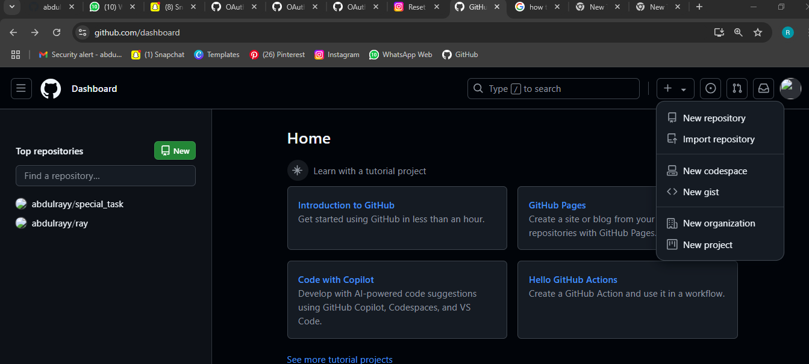
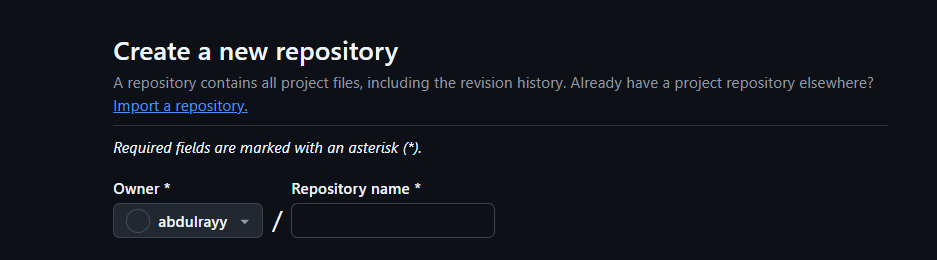
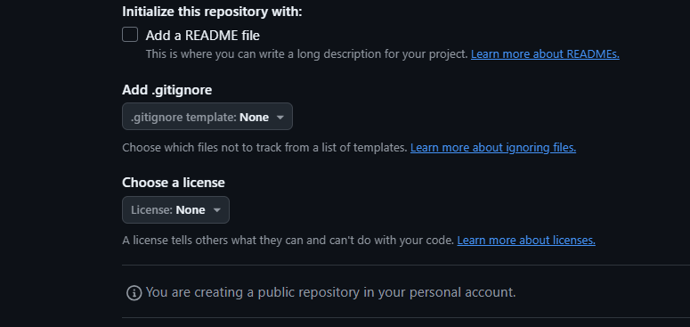

# To create a GitHub repository, we follows the steps below
- Go to the upper-right corner of any page on GitHub and select new respoitory. 
-  Enter a name for your repository. 
- Optionally, add a description if needed. 
- Choose a visibility for repository. 
- Select 
- Click on create repository. 
 ## We can also create a repository from an existing folder by:
- Navigating to the root directory of the project
Running git init
### We can also use GitHub CLI to push a local repository to GitHub: 
- Create a repository for your project on GitHub
- Select Push an existing local repository to GitHub
- Enter a name for your repository
- Confirm to add the remote and push the commits to the current branch
"# special_task" 
